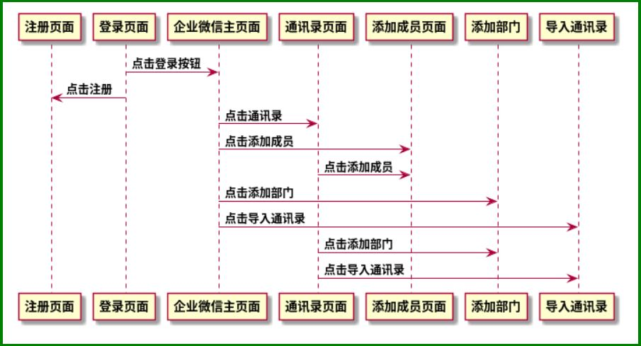

#selenium企业微信第二次实战作业
## 企业微信页面时序图

## 企业微信-添加部门
page_object  页面对象文件夹
- base_page.py
  - class basePage: 页面对象基类
  - def find(self, by, value): 重定义定位元素
  - def finds(self, by, value):重定义定位元素(复数)
  - scrollToElement(self,el): 定义页面滚动el元素可见的位置

- index_page.py
    - class indexPage(basePage) 定义首页对象类
    - def add_cookies(self):添加cookies登录
    - def goto_add_member(self): # 首页：点击添加成员跳到添加成员页面
    - def goto_import_addressBook(self): 点击导入通讯录跳到导入通讯录页面
    - def goto_addressBook(self): 点击导航通讯录跳到通讯录页面
    - def goto_index(self): 点击导航跳回首页

- address_book.py
    - class addressBook(basePage) 定义通讯录对象类
    - def goto_add_member(self):点击跳转到添加成员页
    - def goto_add_department(self): # 点击弹窗添加部门
    - def goto_import_addressBook(self): 点击导入通讯录
    - def get_member_list(self): 获取通讯录页的成员列表
    - def get_department_list(self): 获取通讯录页的部门列表
    - def del_member(self,name): 删除指定的成员
    - def goto_index(self): 点击导航回到首页

- add_member.py
    - class addMember(basePage) 定义添加成员对象类
    - def add_member(self,name,phone):添加成员
    
- add_department.py
    - class addDepartment(basePage) 定义添加部门对象类
    - def add_department(self,name):添加部门

- import_addressBook.py
    - class improtAddressBook(basePage) 定义导入通讯录对象类
    - def import_addressBook(self,name):导入通讯录
    
testcase    测试用例文件夹

